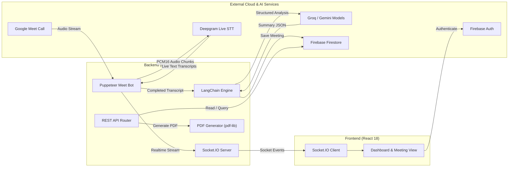

<div align="center">

# 🎙️ MeetScribe

### **AI-Powered Meeting Assistant & Intelligent Transcription Engine**

*Automate Google Meet note-taking, capture live transcripts, generate executive-level AI summaries, and converse with past meetings.*

[](https://reactjs.org/)
[](https://nodejs.org/)
[](https://expressjs.com/)
[](https://firebase.google.com/)
[](https://deepgram.com/)
[](https://www.langchain.com/)
[](https://groq.com/)

[Features](#-key-features) • [Architecture](#-architecture) • [Quick Start Guide](#-quick-start-guide) • [API Reference](#-api-reference) • [Configuration](#-environment-variables)

---

</div>

## 📌 Overview

**MeetScribe** is an end-to-end meeting intelligence platform designed to eliminate manual note-taking and make conversations actionable. 

Using an autonomous browser bot powered by **Puppeteer**, MeetScribe connects to Google Meet calls, captures incoming real-time audio streams, converts voice to text using **Deepgram**, and generates structured meeting intelligence (Key Decisions, Action Items, Speaker Breakdowns, Sentiment Analysis) through **LangChain & Groq/Gemini LLMs**.

All meetings are saved to **Firebase Firestore** with instant search, on-demand **PDF export**, shareable public links, and an **interactive meeting chatbot** that remembers every word spoken.

---

## ✨ Key Features

| Feature | Description |
| :--- | :--- |
| 🤖 **Autonomous Meet Bot** | Puppeteer-driven bot that automatically detects installed browsers (Chrome, Brave, Edge), joins Google Meet links, mutes mic/cam, and captures tab audio streams. |
| 🎙️ **Live Real-Time Transcription** | Streams audio over WebSockets to **Deepgram STT** with live updates streamed directly to the frontend via **Socket.IO**. |
| 📝 **Structured AI Summaries** | Employs high-speed LLMs (Groq LLaMA / Gemini) to extract executive overviews, key decisions, and assigned action items. |
| 🎯 **Action Item Tracker** | Automatically parses tasks, assignees, and priority levels (`high`, `medium`, `low`) from conversations. |
| 📊 **Sentiment & Tone Analysis** | Evaluates participant tone and meeting sentiment (`positive`, `neutral`, `mixed`, `negative`) with clear rationales. |
| 💬 **Conversational Meeting Q&A** | Context-aware **LangChain chatbot** allowing team members to ask questions regarding specific discussion topics. |
| 📄 **One-Click PDF Export** | Generates professionally formatted, client-ready PDF summaries on the fly with `pdf-lib`. |
| 🔗 **Shareable Public Reports** | Generate secure, read-only share links for stakeholders without requiring them to log in. |
| ☁️ **Cloud Database & Indexing** | Full **Firebase Firestore** storage with indexed querying, quick search, and multi-user isolation. |
| 🎨 **Modern Glassmorphic UI** | Responsive dark-mode interface built with React, CSS variables, and animated feedback states. |

---

## 🏗️ Architecture



---

## 🛠️ Tech Stack

### **Frontend**
- **Core**: React 18, JavaScript (ES6+)
- **Routing**: React Router DOM v6
- **Real-Time Communications**: Socket.IO Client
- **Authentication**: Firebase Client SDK
- **Styling**: Vanilla CSS (Custom Design System, Glassmorphism, Dark Mode)

### **Backend**
- **Runtime**: Node.js & Express.js
- **Bot Automation**: Puppeteer (Auto browser detection, zero-configuration)
- **Speech-to-Text**: Deepgram SDK (WebSocket Audio Stream)
- **AI & LLM Orchestration**: LangChain, Groq SDK (`llama-3.3-70b-versatile` / `mixtral`), Google GenAI
- **Database & Auth**: Firebase Admin SDK & Google Cloud Firestore
- **Document Generation**: `pdf-lib`
- **Networking & Sockets**: Socket.IO, `ws`, CORS, `uuid`

---

## 🚀 Quick Start Guide

Follow these steps to get MeetScribe running locally on your machine.

### Prerequisites
- **Node.js**: v18.0.0 or higher ([Download Node.js](https://nodejs.org/))
- **Google Chrome** (or Brave / Edge): Installed on your machine
- **Accounts & API Keys**:
  - [Deepgram API Key](https://console.deepgram.com/) (For real-time speech-to-text)
  - [Groq API Key](https://console.groq.com/) (For ultra-fast summary generation)
  - [Firebase Project](https://console.firebase.google.com/) (For Firestore database and Authentication)

---

### Step 1: Clone Repository & Install Dependencies

```bash
# 1. Clone the repository
git clone https://github.com/saikiran9346/Meet-Scribe.git
cd Meet-Scribe

# 2. Install backend dependencies
cd backend
npm install

# 3. Install frontend dependencies
cd ../frontend
npm install
cd ..
```

---

### Step 2: Configure Environment Variables

#### A. Backend Environment (`backend/.env`)
Create a `.env` file in the `backend/` directory (or copy from `.env.example`):
```env
PORT=8080
FRONTEND_URL=http://localhost:3000
DEEPGRAM_API_KEY=your_deepgram_api_key_here
GROQ_API_KEY=your_groq_api_key_here
HEADLESS=true
```

> **Note**: MeetScribe automatically detects your installed browser (Chrome, Brave, or Edge) and creates dynamic temporary profiles on demand. **No manual path configuration or manual profile setup is required!**

#### B. Frontend Environment (`frontend/.env`)
Create a `.env` file in the `frontend/` directory (or copy from `frontend/.env.example`):
```env
REACT_APP_API_URL=http://localhost:8080
REACT_APP_FIREBASE_API_KEY=your_firebase_api_key
REACT_APP_FIREBASE_AUTH_DOMAIN=your_project_id.firebaseapp.com
REACT_APP_FIREBASE_PROJECT_ID=your_project_id
REACT_APP_FIREBASE_STORAGE_BUCKET=your_project_id.firebasestorage.app
REACT_APP_FIREBASE_MESSAGING_SENDER_ID=your_messaging_sender_id
REACT_APP_FIREBASE_APP_ID=your_firebase_app_id
```

#### C. Firebase Service Account Key
1. In the [Firebase Console](https://console.firebase.google.com/), go to **Project Settings** &rarr; **Service Accounts**.
2. Click **Generate New Private Key** to download your JSON credentials.
3. Rename the downloaded file to `serviceAccount.json` and place it in the project root:
```
meet-scribe/
├── backend/
├── frontend/
├── serviceAccount.json   <-- (Place here)
└── README.md
```

---

### Step 3: Configure Firestore Database & Index

1. In the [Firebase Console](https://console.firebase.google.com/), enable **Firestore Database** in test/production mode.
2. Go to **Firestore Database** &rarr; **Indexes** &rarr; **Composite Indexes** &rarr; **Create Index**:
   - **Collection ID**: `meetings`
   - **Fields**:
     - `userId` &rarr; `Ascending`
     - `createdAt` &rarr; `Descending`
   - **Query Scope**: `Collection`
3. Click **Create Index** (takes 1–2 minutes to build).

---

### Step 4: Run the Application

Open two terminal windows:

#### **Terminal 1: Start Backend Server**
```bash
cd backend
npm start
```
*Server starts on `http://localhost:8080`*

#### **Terminal 2: Start Frontend Client**
```bash
cd frontend
npm start
```
*Web app opens automatically at `http://localhost:3000`*

---

## 💡 How to Use MeetScribe

1. **Sign In**: Open `http://localhost:3000` and sign in with your Google account.
2. **Deploy Bot**:
   - Copy any Google Meet link (e.g. `https://meet.google.com/abc-defg-hij`).
   - Paste it into the MeetScribe launchpad and click **Deploy Bot**.
3. **Live Session**:
   - The bot will join the meeting, mute its mic/camera, and stream real-time transcripts directly to your dashboard.
4. **Stop & Summarize**:
   - Click **Stop & Summarize**.
   - MeetScribe generates an executive overview, action items with assignees, key decisions, and speaker breakdowns.
5. **Chat, Share & Export**:
   - Converse with the meeting context using the **AI Chatbot**.
   - Generate a **read-only public share link** for teammates.
   - Click **PDF** to download a formatted meeting report.

---

## 📡 API Reference

### **Bot Automation Endpoints**
| Method | Endpoint | Description |
| :--- | :--- | :--- |
| `POST` | `/api/bot/start` | Launch bot and join Google Meet (`{ meetUrl }`). Returns `sessionId`. |
| `POST` | `/api/bot/stop` | Exit meeting, stop STT, and trigger AI summary generation. |
| `GET` | `/api/bot/transcript/:sessionId` | Retrieve in-progress live transcript entries. |

### **Meeting Management Endpoints**
| Method | Endpoint | Description |
| :--- | :--- | :--- |
| `GET` | `/api/meetings` | List all saved meetings for the authenticated user (sorted newest first). |
| `GET` | `/api/meetings/:sessionId` | Retrieve full meeting details (summary, transcript, action items). |
| `POST` | `/api/meetings/:sessionId/save` | Explicitly persist temporary meeting memory into Firestore. |
| `DELETE` | `/api/meetings/:sessionId` | Delete a meeting record from Firestore. |

### **Chat & Export Endpoints**
| Method | Endpoint | Description |
| :--- | :--- | :--- |
| `POST` | `/api/meetings/:sessionId/chat` | Send a prompt to the AI chat assistant for context-based answers. |
| `GET` | `/api/meetings/:sessionId/chat` | Fetch conversation history for a meeting session. |
| `POST` | `/api/meetings/:sessionId/share` | Generate public share link (`/share/:sessionId`). |
| `GET` | `/api/share/:sessionId` | Public endpoint to retrieve meeting summary data for read-only view. |
| `GET` | `/api/meetings/:sessionId/pdf` | Check and return PDF generation endpoint. |
| `GET` | `/api/meetings/:sessionId/pdf/download`| Download generated `.pdf` meeting summary document. |

---

## 📁 Repository Structure

```
meet-scribe/
├── backend/
│   ├── bot/
│   │   └── meetBot.js            # Puppeteer browser automator & audio stream handler
│   ├── middleware/
│   │   └── auth.js               # Firebase token authentication & Firestore client
│   ├── routes/
│   │   └── api.js                # Express API route controllers
│   ├── services/
│   │   ├── langchainService.js   # LangChain LLM summarization & chat memory engine
│   │   └── storageService.js     # Firestore meeting CRUD & PDF generation
│   ├── package.json              # Backend dependencies
│   ├── server.js                 # Express server & Socket.IO entry point
│   └── .env                      # Backend environment settings
│
├── frontend/
│   ├── public/
│   │   ├── favicon.svg           # Brand favicon
│   │   ├── icons.svg             # SVG icon sprites
│   │   └── index.html            # Main HTML wrapper
│   ├── src/
│   │   ├── components/           # Navbar, MeetingChatbot, Modal, Cards
│   │   ├── context/              # Firebase Auth Context Provider
│   │   ├── hooks/                # Custom API hooks (useApi)
│   │   ├── pages/
│   │   │   ├── Dashboard.jsx     # Meeting history list & launchpad
│   │   │   ├── Login.jsx         # Firebase authentication page
│   │   │   ├── Session.jsx       # Real-time live transcript stream
│   │   │   ├── Summary.jsx       # Tabbed summary, decisions, actions & chat
│   │   │   └── Share.jsx         # Public read-only meeting share view
│   │   ├── styles/               # Main responsive CSS system
│   │   ├── App.jsx               # Route definitions & protection
│   │   └── index.js              # React entry point
│   ├── package.json              # Frontend dependencies
│   └── .env                      # Frontend environment settings
│
├── .env.example                  # Backend environment template
├── .gitignore                    # Git security & build exclusion rules
├── DEPLOYMENT-GUIDE.md           # Production deployment instructions
└── README.md                     # Comprehensive project documentation
```

---

## 🔒 Security & Privacy

- **Protected Secrets**: Sensitive files like `.env`, `serviceAccount.json`, and `.pem` certificates are strictly excluded via `.gitignore`.
- **User Isolation**: Firestore documents and meeting records are keyed and scoped to individual Firebase `userId`s.
- **Audio Capture Safety**: Audio streams are only captured during active sessions and converted to text; no raw ambient audio is permanently stored without consent.
- **Stateless Tokens**: API requests utilize Firebase ID tokens (`Bearer <token>`) for secure stateless authentication.

---

## 🤝 Contributing

Contributions, issues, and feature requests are welcome!

1. Fork the repository
2. Create your feature branch (`git checkout -b feature/awesome-feature`)
3. Commit your changes (`git commit -m 'feat: add awesome feature'`)
4. Push to the branch (`git push origin feature/awesome-feature`)
5. Open a Pull Request

---

## 📄 License

This project is licensed under the MIT License — see the [LICENSE](LICENSE) file for details.

<div align="center">
  <sub>Built with ❤️ by <a href="https://github.com/saikiran9346">Sai Kiran</a>.</sub>
</div>
