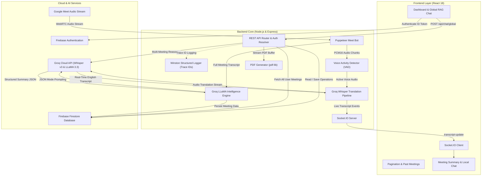

<div align="center">

# 🎙️ MeetScribe

### **Enterprise-Grade AI Meeting Assistant, Multilingual Translation & Intelligence Platform**

*Autonomous Google Meet bot, 99+ language real-time speech translation into English via Groq Whisper, executive-grade AI summaries, cross-meeting RAG intelligence, Docker containerization, and structured observability.*

[](https://github.com/saikiran9346/Meet-Scribe/actions)
[](https://www.docker.com/)
[](https://reactjs.org/)
[](https://nodejs.org/)
[](https://expressjs.com/)
[](https://firebase.google.com/)
[](https://groq.com/)
[](https://groq.com/)
[](https://github.com/winstonjs/winston)
[](https://jestjs.io/)

[Features](#-key-features) • [Architecture](#-architecture) • [Docker Quick Start](#-docker-quick-start) • [Local Setup](#-local-quick-start) • [Observability](#-structured-logging--observability) • [API Reference](#-api-reference)

---

</div>

## 📌 Overview

**MeetScribe** is a production-ready meeting intelligence platform designed to eliminate manual note-taking, break multilingual barriers, and turn team conversations into structured, searchable organizational knowledge.

Powered by an autonomous **Puppeteer** browser bot, MeetScribe joins Google Meet sessions, captures low-latency PCM16 tab audio, filters background silence via Energy Voice Activity Detection (VAD), and streams voice data to **Groq Whisper Large-v3 (`whisper-large-v3`)** to translate speech from **99+ languages directly into fluent English in real-time** (~150ms latency).

Upon session completion, an AI intelligence engine synthesizes executive summaries, decision logs, priority-tagged action items, speaker contribution breakdowns, and sentiment analytics. Everything is persisted in **Firebase Firestore**, backed by **on-the-fly PDF exports**, **public shareable links**, **per-meeting deep-dive AI chat**, and a **Global Cross-Meeting RAG Assistant** on the dashboard.

The entire platform is fully containerized with **Docker & Docker Compose**, verified with **GitHub Actions CI/CD**, and monitored via **Winston structured JSON logging with distributed trace correlation IDs**.

---

## ✨ Key Features

| Feature | Description |
| :--- | :--- |
| 🤖 **Autonomous Meet Bot** | Puppeteer-driven bot auto-detects system browsers (Chrome, Brave, Edge), joins Google Meet calls, auto-mutes mic/camera, and captures PCM16 WebRTC tab audio. |
| 🌐 **99+ Multilingual Speech Translation** | Speaks in **Hindi, Telugu, Tamil, Spanish, French, German, Japanese, Chinese, Arabic, or Hinglish**? Groq Whisper translates the speech **directly into clean English in real-time**. |
| 🐳 **Full Docker Containerization** | Production-ready multi-stage Docker builds: backend with bundled Chromium for headless Puppeteer, and frontend served via lightweight Alpine Nginx. |
| 🔄 **Automated CI/CD Pipeline** | GitHub Actions workflow validates every push/PR with backend unit & integration tests, mock Firestore stubbing, frontend builds, and Docker Compose validation. |
| 📊 **Structured JSON Logging & Tracing** | Enterprise Winston logger emitting standardized JSON with `timestamp`, `level`, `traceId`, `action`, and duration metrics. Automatically attaches `X-Trace-Id` headers. |
| 🧠 **Global Cross-Meeting Intelligence (RAG)** | Ask natural-language questions across **all past meetings** right from the Dashboard (*"What decisions did we make this month?"*, *"List all tasks assigned to Rahul"*). |
| 💬 **Per-Meeting Deep-Dive AI Chatbot** | Context-aware assistant on individual meeting summary pages to drill down into exact discussion points and speaker arguments. |
| 📝 **Executive-Grade AI Summaries** | Comprehensive multi-paragraph overviews, exhaustive key decisions with rationale, and actionable tasks with priority badges (`high`, `medium`, `low`). |
| 👥 **Speaker Contribution Breakdown** | Identifies participants via Google Meet DOM scrapers & acoustic diarization, detailing each person's arguments and key contributions. |
| 📄 **One-Click PDF Reports** | Generates client-ready, multi-page paginated PDF documents on-the-fly using `pdf-lib` without third-party PDF service dependencies. |
| 🔗 **Shareable Public Links** | Generates secure, read-only share URLs allowing external stakeholders to review summaries without requiring login. |
| 📑 **LeetCode-Style Dashboard Pagination** | Clean 5-meetings-per-page pagination with quick `‹ Prev` / `Next ›` controls and active page tracking. |
| ⚡ **Zero-Card Free Cloud Processing** | Runs 100% on free-tier services (Groq Cloud + Firebase) with **zero credit card requirements** and zero local GPU hardware strain. |

---

## 🏗️ Architecture



---

## 🛠️ Tech Stack

### **Frontend**
- **Framework**: React 18, JavaScript (ES6+)
- **Routing**: React Router DOM v6
- **Real-Time Client**: Socket.IO Client
- **Authentication**: Firebase Client SDK (Email/Password, Google Sign-In)
- **Styling**: Vanilla CSS (Custom Glassmorphism Design System, Responsive Grid/Flexbox)

### **Backend**
- **Runtime**: Node.js (v18+) & Express.js
- **Browser Automation**: Puppeteer (Auto-detects Chrome, Brave, and Edge on Windows/Linux/macOS)
- **Speech-to-Text & Translation**: Groq Whisper Large-v3 (`whisper-large-v3` via `/v1/audio/translations`)
- **Language Models**: Groq Cloud (`llama-3.3-70b-versatile`, `llama-3.1-8b-instant`) with automatic fallback routing
- **AI Orchestration**: LangChain, Direct Groq API in native JSON Object Mode
- **Database**: Firebase Admin SDK & Google Cloud Firestore
- **Document Generation**: `pdf-lib`
- **Observability**: Winston v3 structured JSON logger with correlation IDs
- **Testing**: Jest & Supertest integration test suite
- **Networking**: WebSockets (`ws`), Socket.IO, CORS

### **DevOps & Infrastructure**
- **Containerization**: Docker, Docker Compose, Multi-Stage Builds
- **CI/CD Pipeline**: GitHub Actions (linting, automated testing, Docker build verification)
- **Deployment**: AWS EC2 (Free Tier) with Nginx reverse proxy, Netlify (Frontend)

---

## 🐳 Docker Quick Start

Run the entire MeetScribe stack (Backend with Chromium + Frontend with Nginx) in a single command:

```bash
# 1. Clone repository
git clone https://github.com/saikiran9346/Meet-Scribe.git
cd Meet-Scribe

# 2. Place your serviceAccount.json in project root
# (Obtained from Firebase Console -> Project Settings -> Service Accounts)

# 3. Create backend/.env file with your Groq API Key
cat > backend/.env << 'EOF'
PORT=8080
FRONTEND_URL=http://localhost:3000
GROQ_API_KEY=your_groq_api_key_here
HEADLESS=true
EOF

# 4. Build and run containers
docker compose up --build
```

- **Frontend**: Accessible at `http://localhost:3000`
- **Backend**: Accessible at `http://localhost:8080` (Health check: `http://localhost:8080/health`)

To stop:
```bash
docker compose down
```

---

## 💻 Local Quick Start

### Prerequisites
- **Node.js**: v18.0.0 or higher ([Download Node.js](https://nodejs.org/))
- **Google Chrome** (or Brave / Edge) installed
- **API Keys & Accounts** (100% Free):
  - [Groq Cloud](https://console.groq.com/) (Free API key — no credit card needed)
  - [Firebase Console](https://console.firebase.google.com/) (Free project with Firestore enabled)

### Step 1: Clone Repository
```bash
git clone https://github.com/saikiran9346/Meet-Scribe.git
cd Meet-Scribe
```

### Step 2: Configure Backend
```bash
cd backend
npm install
```

Create `backend/.env`:
```env
PORT=8080
FRONTEND_URL=http://localhost:3000
GROQ_API_KEY=gsk_your_groq_api_key_here
HEADLESS=false
```
Place your Firebase Service Account file in the project root as `serviceAccount.json`.

### Step 3: Configure Frontend
```bash
cd ../frontend
npm install
```

Create `frontend/.env`:
```env
REACT_APP_API_URL=http://localhost:8080
REACT_APP_FIREBASE_API_KEY=your_firebase_api_key
REACT_APP_FIREBASE_AUTH_DOMAIN=your_project.firebaseapp.com
REACT_APP_FIREBASE_PROJECT_ID=your_project_id
REACT_APP_FIREBASE_STORAGE_BUCKET=your_project.firebasestorage.app
REACT_APP_FIREBASE_MESSAGING_SENDER_ID=your_sender_id
REACT_APP_FIREBASE_APP_ID=your_app_id
```

### Step 4: Run Services

**Terminal 1 (Backend)**:
```bash
cd backend
npm start
```
*Backend runs on `http://localhost:8080`.*

**Terminal 2 (Frontend)**:
```bash
cd frontend
npm start
```
*Frontend opens at `http://localhost:3000`.*

---

## 📊 Structured Logging & Observability

MeetScribe implements enterprise-grade structured JSON logging powered by **Winston**:

- **Trace Correlation IDs**: Every HTTP request receives an incoming `X-Request-Id` or generates a UUID `traceId`. All logs emitted during a request or meeting session share the exact same `traceId`.
- **Response Headers**: Responses include the `X-Trace-Id` header so frontend clients can correlate their requests directly with server logs.
- **Latency Tracking**: Express middleware automatically records request duration in milliseconds upon completion.

### Sample Structured Log Line:
```json
{
  "timestamp": "2026-09-09T10:30:15.123Z",
  "level": "info",
  "message": "GET /health 200 (3ms)",
  "traceId": "d3b07384-d113-4696-9812-850f12d5d713",
  "action": "http_request_complete",
  "service": "meetscribe-backend",
  "statusCode": 200,
  "durationMs": 3
}
```

---

## 🧪 Testing

MeetScribe includes automated integration and unit test suites running via **Jest** and **Supertest**:

```bash
cd backend
npm test
```

### What is Tested:
- **Health & Root Endpoints**: Status codes, content types, and server uptime.
- **Meeting APIs**: Input validation, 404 handling, and Firestore schema shapes.
- **Bot Control**: Parameter verification, session validation, and transcript streaming.
- **Structured Logger**: Winston format transformations, child logger metadata inheritance, and `X-Trace-Id` HTTP header propagation.
- **CI-Safe In-Memory Firestore**: Deterministic tests execute in CI environments without live Firebase credentials.

---

## 📡 API Reference

### **Bot Automation**
| Method | Endpoint | Description |
| :--- | :--- | :--- |
| `POST` | `/api/bot/start` | Launch Puppeteer bot and navigate to Google Meet URL |
| `POST` | `/api/bot/stop` | Leave call, finalize transcript, and generate executive summary |
| `GET` | `/api/bot/transcript/:sessionId` | Retrieve real-time in-memory transcript for an active call |

### **Meetings & Firestore Persistence**
| Method | Endpoint | Description |
| :--- | :--- | :--- |
| `GET` | `/api/meetings` | List all saved meetings for the authenticated user |
| `GET` | `/api/meetings/:sessionId` | Get complete meeting data (overview, decisions, action items, transcript) |
| `POST` | `/api/meetings/:sessionId/save` | Persist temporary meeting data permanently to Firestore |
| `DELETE` | `/api/meetings/:sessionId` | Delete meeting record from Firestore |

### **AI Chatbots (Per-Meeting & Global RAG)**
| Method | Endpoint | Description |
| :--- | :--- | :--- |
| `POST` | `/api/meetings/:sessionId/chat` | Chat with AI about a specific meeting's transcript |
| `GET` | `/api/meetings/:sessionId/chat` | Get conversation history for a specific meeting |
| `POST` | `/api/chat/global` | **Cross-Meeting RAG**: Ask questions across all saved meetings with citations |

### **Export & Sharing**
| Method | Endpoint | Description |
| :--- | :--- | :--- |
| `GET` | `/api/meetings/:sessionId/pdf/download` | Stream and download generated PDF document |
| `POST` | `/api/meetings/:sessionId/share` | Generate public read-only report URL |
| `GET` | `/api/share/:sessionId` | Public unauthenticated endpoint to view shared summary |

---

## 📂 Project Structure

```
meet-scribe/
├── .github/
│   └── workflows/
│       └── ci.yml                      # GitHub Actions CI/CD pipeline
├── backend/
│   ├── __tests__/                      # Jest & Supertest automated test suite
│   │   ├── api.test.js                 # REST API integration tests
│   │   └── logger.test.js              # Structured logger & trace ID unit tests
│   ├── bot/
│   │   └── meetBot.js                  # Puppeteer bot + WebRTC capture & Whisper translation
│   ├── middleware/
│   │   └── auth.js                     # Firebase Admin SDK & CI-safe mock Firestore
│   ├── routes/
│   │   └── api.js                      # Express REST API routes with trace logging
│   ├── services/
│   │   ├── langchainService.js         # Groq LLM summarization, translation & RAG chat
│   │   └── storageService.js           # Firestore operations & PDF generator
│   ├── utils/
│   │   └── logger.js                   # Winston structured logger & request tracing
│   ├── app.js                          # Express app export for testing
│   ├── server.js                       # Server entry point & Socket.IO listeners
│   ├── Dockerfile                      # Multi-stage backend container with Chromium
│   ├── .dockerignore
│   └── package.json
├── frontend/
│   ├── src/
│   │   ├── components/
│   │   │   ├── BotControl.jsx          # Meeting launcher widget
│   │   │   ├── GlobalMeetingChatbot.jsx# Cross-meeting RAG AI assistant
│   │   │   ├── LiveTranscript.jsx      # Real-time streaming transcript view
│   │   │   ├── MeetingChatbot.jsx      # Per-meeting deep-dive chatbot
│   │   │   └── Navbar.jsx              # Header & authentication navigation
│   │   ├── context/
│   │   │   └── AuthContext.jsx         # Firebase user authentication state
│   │   ├── pages/
│   │   │   ├── Dashboard.jsx           # Main dashboard with pagination (5/page)
│   │   │   ├── Session.jsx             # Live recording & interim transcript view
│   │   │   ├── Summary.jsx             # Tabbed executive meeting report & PDF
│   │   │   ├── PublicSummary.jsx       # Public shareable view
│   │   │   └── Login.jsx               # User authentication
│   │   ├── styles/
│   │   │   └── main.css                # Glassmorphic design system
│   │   ├── firebase.js                 # Firebase client SDK initialization
│   │   └── App.jsx                     # Route configuration
│   ├── Dockerfile                      # Multi-stage frontend container with Nginx
│   ├── nginx.conf                      # Nginx SPA routing configuration
│   ├── .dockerignore
│   └── package.json
├── docker-compose.yml                  # Docker Compose orchestration
├── DEPLOYMENT-GUIDE.md                 # Complete AWS EC2 & Netlify deployment guide
├── serviceAccount.json                 # Firebase Admin credentials (git ignored)
├── README.md
└── .gitignore
```

---

## 🔒 Security & Privacy

- **Protected Credentials**: Protected via `.gitignore`. Service accounts, private keys, and `.env` files are never tracked in version control.
- **Ephemeral Sandbox**: Each browser bot instance operates in a sandboxed, temporary profile that is automatically purged upon session completion.
- **Token Verification**: User endpoints are guarded by Firebase Authentication Bearer token validation and multi-tenant isolation.
- **CI Safety**: Automated CI tests utilize local in-memory stubs, ensuring zero external network leaks or credential dependencies.

---

## 📜 License

This project is open-source and available under the **MIT License**.
